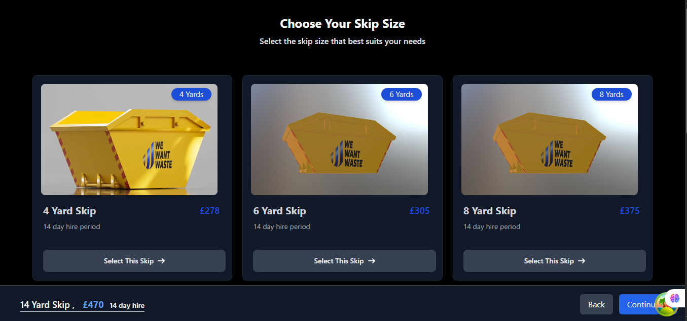

````markdown
# 🚛 Skip Size Picker App

A responsive React + Vite application for selecting skip sizes, featuring server-side rendering with TanStack Query, custom loading/error states, and deployment via Vercel.



## 📌 Features

- ⚛️ Built with **React + Vite**
- ⚡️ Server-side rendering via **TanStack Query**
- 🌀 Custom loading and error boundaries
- 📱 Fully responsive (mobile-first design)
- 📦 Integrated with real data fetching and conditional logic
- ☁️ Deployed with **Vercel**


## 🌐 Live Demo

👉 [View Live on Vercel](https://wallelignskipsize-psi.vercel.app/)


## ⚙️ Getting Started

### 1. Clone the repository

```bash
git clone https://github.com/wallelignworkie/React-code-challenge.git
cd React-code-challenge
```
````

### 2. Install dependencies

```bash
npm install
# or
yarn
```

### 3. Create a `.env` file

Create a `.env` file in the root directory:

```bash
touch .env
```

Add your environment variables:

```
VITE_API_BASE_URL=https://app.wewantwaste.co.uk/api/
```

> ⚠️ All environment variables must be prefixed with `VITE_` to be accessible in the Vite app.

---

### 4. Run the development server

```bash
npm run dev
```

App will be available at:
[http://localhost:2525](http://localhost:2525) _(or the default Vite port 5173)_

---

### 5. Build for production

```bash
npm run build
```

### 6. Preview production build locally


npm run preview

## 🚀 Deployment

This project is deployed via **Vercel**.

### To deploy:

1. Push your repo to GitHub
2. Go to [https://vercel.com/import](https://vercel.com/import)
3. Import the GitHub repository
4. Set up your environment variables in Vercel’s dashboard
5. Deploy 🚀


## 🔁 SSR with TanStack Query

This app uses **TanStack Query** for:

- Server-side data prefetching
- Route-level loading states
- Route-based error boundaries

### Example Features:

- `fetchStatus === 'loading'` used for conditional UI
- `<SkeletonLoading />` displayed while data loads
- Error fallback handled via boundary components


## 🤝 Contributing

Pull requests are welcome!

### To contribute:

# 1. Fork the repo
# 2. Create your feature branch
git checkout -b feature-name

# 3. Commit your changes
git commit -m "Add new feature"

# 4. Push to GitHub
git push origin feature-name

# 5. Open a pull request


## 📎 Useful Scripts


npm run dev       # Start development server
npm run build     # Build for production
npm run preview   # Preview production build


## 📄 License

This project is licensed under the [MIT License](./LICENSE).


