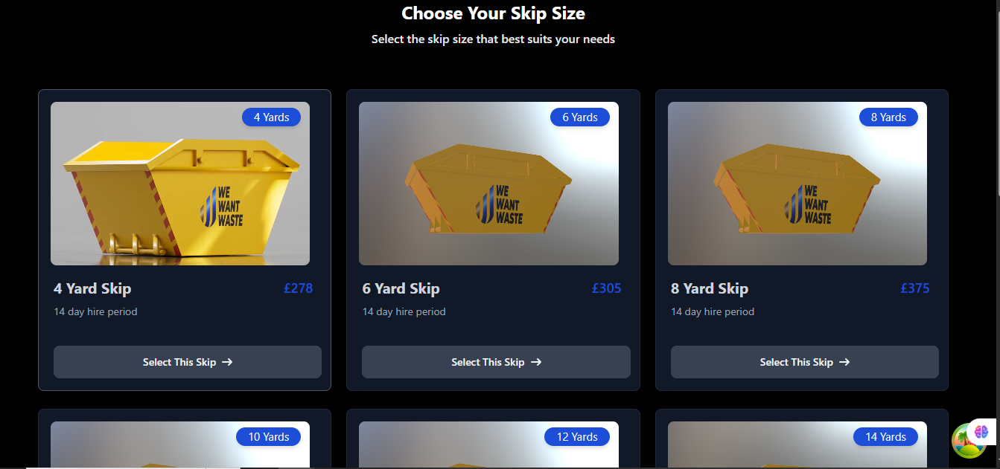

# 🚛 Skip Size Picker App

A responsive React + Vite application for selecting skip sizes, featuring server-side rendering with TanStack, custom loading/error states, and deployment via Vercel.

 <!-- Optional screenshot -->

---

## 📌 Features

- ⚛️ Built with **React + Vite**
- ⚡️ Server-side rendering via **TanStack Router**
- 🌀 Custom loading and error boundaries
- 📱 Fully responsive (mobile-first design)
- 📦 Integrated with real data fetching and conditional logic
- ☁️ Deployed with **Vercel**

---

## 🌐 Live Demo

👉 [View Live on Vercel](https://your-project-name.vercel.app)

---

## 📂 Project Structure

├── public/ # Static files
├── src/
│ ├── assets/ # Images and media
│ ├── components/ # Reusable components
│ ├── hooks/ # Custom React hooks
│ ├── pages/ # Page-level components
│ ├── types/ # TypeScript types
│ ├── skeletonLoading/ # Custom skeleton loaders
│ ├── App.tsx
│ └── main.tsx
├── .env # Environment variables (see below)
├── index.html
├── package.json
├── vite.config.ts
└── tsconfig.json

yaml
Copy
Edit

---

## ⚙️ Getting Started

### 1. Clone the repository

```bash
git clone https://github.com/your-username/your-project-name.git
cd your-project-name
2. Install dependencies
bash
Copy
Edit
npm install
# or
yarn
3. Create a .env file
Make sure to create a .env file in the root directory for your environment variables.

bash
Copy
Edit
touch .env
Inside .env, add your variables like:

ini
Copy
Edit
VITE_API_BASE_URL=https://your-api-url.com
⚠️ Make sure to prefix all your environment variables with VITE_ so they are accessible in the Vite app.

4. Run the development server
bash
Copy
Edit
npm run dev
App will be available at http://localhost:5173

5. Build for production
bash
Copy
Edit
npm run build
6. Preview production build locally
bash
Copy
Edit
npm run preview
🚀 Deployment
This project is deployed via Vercel.

To deploy:

Push your repo to GitHub

Go to https://vercel.com/import

Import the GitHub repository

Set up your environment variables in Vercel’s dashboard

Deploy 🚀

🔁 SSR with TanStack Router
This app uses TanStack Router for:

Server-side rendering (SSR)

Route-level loading states

Route-based error boundaries

Example Features:
Route-aware <SkeletonLoading />

Error fallback using TanStack’s errorElement

Conditional rendering during fetchStatus === 'loading'

🧪 Testing
Optional: Include only if you're writing tests.

bash
Copy
Edit
npm run test
📄 License
This project is licensed under the MIT License.

🙋‍♂️ Author & Contact
Developed by Your Name
📫 Contact: your.email@example.com

🤝 Contributing
Pull requests are welcome! For major changes, please open an issue first to discuss what you'd like to change.

Fork the repo

Create your feature branch (git checkout -b feature-name)

Commit your changes (git commit -m 'Add new feature')

Push to the branch (git push origin feature-name)

Open a pull request

📎 Useful Scripts
bash
Copy
Edit
npm run dev       # Start dev server
npm run build     # Create production build
npm run preview   # Preview production build
vbnet
Copy
Edit

Let me know if you’d like this written into a `README.md` file or need help pushing it to GitHub.


 


Tools


Chat
```
